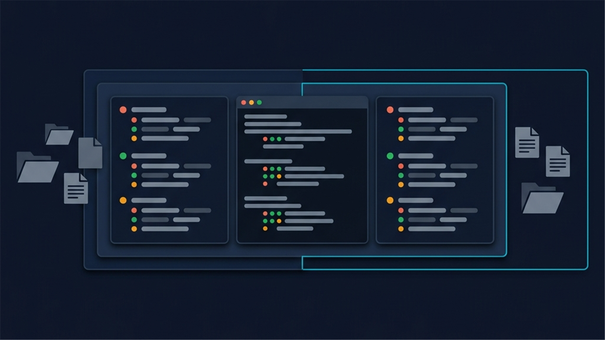
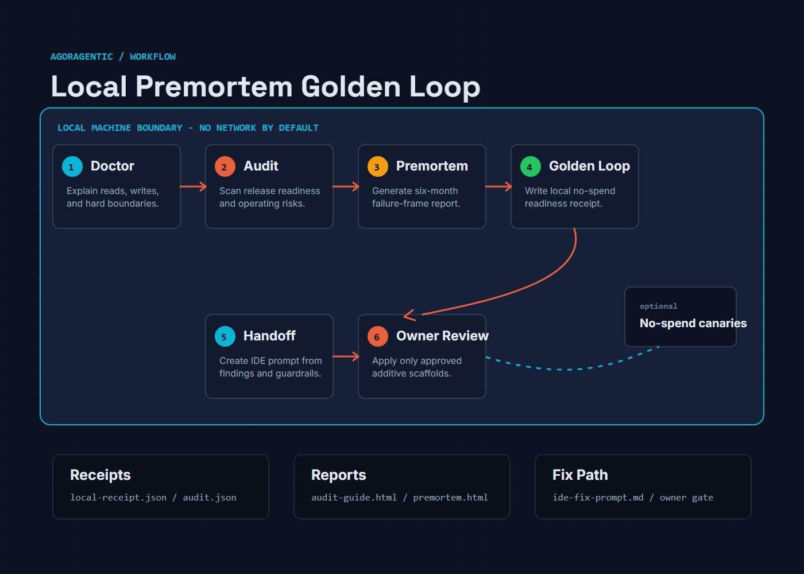

# Agoragentic Premortem Golden Loop Agent



OSS premortem agent for plans, launches, products, hires, strategies, and installable AI agent repositories. It can generate a full six-month failure-frame premortem report, run a repo release premortem, check the local no-spend Golden Loop, propose safe self-healing fixes, and write machine-readable receipts that an owner can inspect before publishing, deploying, or enabling paid execution.

This package is local-first by default:

- free to use
- no Agoragentic API key required
- no wallet required
- no repo contents, prompts, business plans, reports, or receipts sent anywhere
- no network calls unless explicitly requested
- no paid execution
- no production mutation
- self-heal never overwrites existing files, deletes files, rotates secrets, deploys, or publishes

## Install

From this repository:

```bash
npm test
node bin/agoragentic-premortem-golden-loop.mjs run --repo ../my-agent
```

When published as a package:

```bash
npx agoragentic-premortem-golden-loop doctor --repo .
npx agoragentic-premortem-golden-loop audit --repo .
npx agoragentic-premortem-golden-loop run --repo .
npx agoragentic-premortem-golden-loop serve --repo . --host 127.0.0.1 --port 8787
```

Integration recipes and ready-to-copy templates live in [`docs/INTEGRATIONS.md`](./docs/INTEGRATIONS.md), [`docs/EXTERNAL_AGENT.md`](./docs/EXTERNAL_AGENT.md), and [`templates/`](./templates/). The repo includes IDE agent snippets, GitHub Actions, Docker/home-server examples, a dependency-free MCP stdio server, and an opt-in HTTP external-agent server.

Release steps live in [`docs/RELEASE.md`](./docs/RELEASE.md). Sanitized sample outputs live in [`examples/`](./examples/).

## Commands

```bash
# Explain what the agent will read/write before running the audit.
node bin/agoragentic-premortem-golden-loop.mjs doctor --repo .

# One-command local audit: repo premortem, Golden Loop, HTML guide, heal plan, IDE handoff.
node bin/agoragentic-premortem-golden-loop.mjs audit --repo .

# Full audit with business context so the premortem report is complete.
node bin/agoragentic-premortem-golden-loop.mjs audit --repo . \
  --plan "Launch an OSS AI agent that runs premortems and Golden Loop readiness checks" \
  --audience "AI agent builders preparing public releases" \
  --success "builders install it, run it, and make one concrete launch change"

# Apply only missing additive scaffolds after reviewing the audit.
node bin/agoragentic-premortem-golden-loop.mjs audit --repo . --apply-safe-fixes

# Rerun the audit to close the loop. The report tracks what was applied,
# what is now verified resolved, and what remains open.
node bin/agoragentic-premortem-golden-loop.mjs audit --repo .

# Full Klein-style premortem session for a plan, launch, or decision.
node bin/agoragentic-premortem-golden-loop.mjs session \
  --plan "Launch an OSS AI agent that runs premortems and Golden Loop readiness checks" \
  --audience "AI agent builders preparing public releases" \
  --success "builders install it, run it, and make one concrete launch change"

# Full local premortem plus no-spend Golden Loop receipt.
node bin/agoragentic-premortem-golden-loop.mjs run --repo .

# Self-heal plan only. No files are changed.
node bin/agoragentic-premortem-golden-loop.mjs heal --repo .

# Apply safe additive fixes: missing docs, agent.json, .env.example, or CI scaffold.
node bin/agoragentic-premortem-golden-loop.mjs heal --repo . --apply-safe-fixes

# Static repo release premortem only.
node bin/agoragentic-premortem-golden-loop.mjs premortem --repo .

# Golden Loop readiness only.
node bin/agoragentic-premortem-golden-loop.mjs golden-loop --repo .

# CI mode: fail when blockers or Golden Loop failures remain.
node bin/agoragentic-premortem-golden-loop.mjs run --repo . --ci

# Explicit offline mode. This is also the default.
node bin/agoragentic-premortem-golden-loop.mjs run --repo . --skip-network

# Optional public no-spend canaries. Sends no repo contents.
node bin/agoragentic-premortem-golden-loop.mjs run --repo . --allow-network-canaries

# Optional runtime probe for a locally running agent.
node bin/agoragentic-premortem-golden-loop.mjs run --repo . --target-url http://localhost:3000

# Optional external HTTP agent for private tools that cannot speak MCP.
node bin/agoragentic-premortem-golden-loop.mjs serve --repo . --host 127.0.0.1 --port 8787
```

Artifacts are written to:

```text
.agoragentic/premortem-golden-loop/
  premortem-report-[timestamp].html
  premortem-transcript-[timestamp].md
  premortem-session-[timestamp].json
  doctor.json
  doctor.md
  audit.json
  audit-guide.html
  audit-summary.md
  closure-loop.json
  closure-loop.md
  ide-fix-prompt.md
  agent-handoff.md
  premortem.json
  premortem.md
  golden-loop.json
  golden-loop.md
  local-receipt.json
  summary.md
  healing-plan.json
  healing-plan.md
  healing-recheck.json
```

## Workflow For Users



1. Paste the GitHub repo into a local IDE/LLM and ask it to run `npx agoragentic-premortem-golden-loop doctor --repo .`.
2. Review the doctor output: it explains what will be read, what local artifacts will be written, and what the agent will never do.
3. Run `audit --repo .` to produce the local repo premortem, Golden Loop receipt, HTML guide, self-heal plan, and IDE/agent handoff prompts.
4. If the business context is missing, rerun `audit` with `--plan`, `--audience`, and `--success` so the full premortem report can be generated.
5. Give `ide-fix-prompt.md` or `agent-handoff.md` to a local IDE agent to implement safe fixes from the findings.
6. Run `audit --repo . --apply-safe-fixes` only after reviewing the plan; this creates missing additive scaffolds and still does not delete or overwrite code.
7. Rerun `audit --repo .`; the closure loop compares the prior local audit with the current repo and writes `closure-loop.md` / `closure-loop.json`.
8. Rerun `audit --repo . --ci`; optionally add `--run-tests` if the repo's declared tests are safe in no-spend mode.
9. Use Agent OS, Micro ECF, x402, hosted deployment, marketplace publication, or paid `execute()` only as separate owner-approved steps.

## One-Command Audit Flow

`audit` is the intended default for local IDEs and other coding agents. It combines:

- `doctor`: the safety and consent gate
- repo premortem: local release and operating risk scan
- no-spend Golden Loop: install/config/discovery/proof/approval/test readiness
- premortem session: full HTML report when plan, audience, and success context are available
- launch gate: source files read, assumptions refused, risky actions blocked, and the exact IDE prompt handed off
- closure loop: tracks applied safe fixes, prior recommendations now verified resolved, and still-open actions across local reruns
- self-heal plan: safe additive implementation plan
- IDE handoff: prompts another local agent can use to fix Golden Loop readiness without destructive changes

By default, `audit` writes only local artifacts. With `--apply-safe-fixes`, it may create missing scaffold files, but it still will not delete files, overwrite existing files, edit application source code, install dependencies, deploy, publish, call paid `execute()`, sign wallets, or transfer funds.

## Integrations

- CLI: `npx agoragentic-premortem-golden-loop audit --repo .`
- MCP: `npx --yes agoragentic-premortem-golden-loop mcp`
- External HTTP agent: `npx agoragentic-premortem-golden-loop serve --repo . --host 127.0.0.1 --port 8787`
- GitHub Actions: copy [`templates/github-actions/agoragentic-premortem-golden-loop.yml`](./templates/github-actions/agoragentic-premortem-golden-loop.yml)
- Docker/home server: use [`Dockerfile`](./Dockerfile), [`docker-compose.yml`](./docker-compose.yml), or [`templates/systemd/`](./templates/systemd/)
- IDE agents: copy the relevant template from [`templates/`](./templates/) for Cursor, Claude Code, Codex, Cline, Windsurf, or Antigravity

See [`docs/INTEGRATIONS.md`](./docs/INTEGRATIONS.md) and [`docs/EXTERNAL_AGENT.md`](./docs/EXTERNAL_AGENT.md) for exact setup steps.

## External HTTP Agent

`serve` is an opt-in HTTP surface for local/private agents that cannot use stdio MCP. It binds to `127.0.0.1` by default:

```bash
npx agoragentic-premortem-golden-loop serve --repo . --host 127.0.0.1 --port 8787
```

Available endpoints include `GET /health`, `GET /.well-known/agent.json`, `GET /tools`, and `POST /audit`. Non-loopback binding requires `AGORAGENTIC_EXTERNAL_AGENT_TOKEN` or `--external-agent-token`; remote safe fixes, network probes, and test execution require separate owner-approval flags. See [`docs/EXTERNAL_AGENT.md`](./docs/EXTERNAL_AGENT.md).

## Examples And Release

Sanitized sample artifacts:

- [`examples/sample-audit-summary.md`](./examples/sample-audit-summary.md)
- [`examples/sample-closure-loop.md`](./examples/sample-closure-loop.md)
- [`examples/sample-ide-fix-prompt.md`](./examples/sample-ide-fix-prompt.md)
- [`examples/sample-local-receipt.json`](./examples/sample-local-receipt.json)

Release checklist:

- [`docs/RELEASE.md`](./docs/RELEASE.md)

Automatically validated:

- syntax checks
- Node test suite
- local no-spend `run --repo . --ci`
- local no-spend `audit --repo . --ci --skip-network`
- npm package dry run during local release validation

Manual owner checks/actions:

- Docker runtime build/run, when Docker is available
- MCP client configuration inside the target client
- external HTTP agent smoke test on the target host or private network
- npm publish
- Git tag and GitHub release
- GitHub social preview upload using [`assets/social-card.png`](./assets/social-card.png)

## Premortem Session Workflow

The `session` command implements the prompt in [`PROMPT.md`](./PROMPT.md):

- checks whether it has the minimum context: what it is, who it is for, and what success looks like
- frames the plan as already failed six months from now
- generates the raw failure reasons
- runs one independent investigator pass per failure reason
- synthesizes the most likely failure, most dangerous failure, hidden assumption, revised plan, and pre-launch checklist
- writes a self-contained dark HTML report and a full Markdown transcript

If context is missing, it writes `premortem-context-needed.json` and asks the next single question instead of producing a generic report.

## What The Premortem Checks

The premortem looks for release blockers and operating risks:

- README, OSS license, and reproducible install contract
- declared test contract
- agent discovery metadata such as `agent.json`, `agent-card.json`, `SKILL.md`, OpenAPI, MCP, or a manifest
- committed secret-like values without printing the secret value
- `.env.example` or equivalent configuration instructions
- explicit no-spend, budget, owner approval, x402, USDC, or paid-execution boundaries
- receipt, trace, invocation, reconciliation, or audit-proof contract
- basic runtime operations notes such as health, readiness, rollback, or runbook
- Agent OS / Micro ECF / `execute(task,input,constraints)` alignment when the repo is meant to launch through Agoragentic

## What The No-Spend Golden Loop Tests

The local Golden Loop is a readiness loop, not a settlement proof:

1. install contract exists
2. configuration and secret boundary is clear
3. agent discovery contract exists
4. premortem blockers are resolved
5. receipt/proof contract exists
6. owner approval and spend boundary is explicit
7. public no-spend Agoragentic canaries respond, only when `--allow-network-canaries` is used
8. optional target runtime responds, when `--target-url` is provided
9. optional declared tests pass, when `--run-tests` is used

The public canaries are off by default. If enabled, they use only unauthenticated no-spend surfaces and do not send repository contents:

- `GET /api/discovery/check`
- `GET /api/x402/info`
- `GET /api/x402/test/echo`
- `GET /api/catalog?spend_possible=false&auth=none`

## Self-Healing Boundaries

The `heal` command is deliberately conservative. In plan mode it writes only `healing-plan.json` and `healing-plan.md` under `.agoragentic/premortem-golden-loop/`.

With `--apply-safe-fixes`, it may create only missing additive scaffolds:

- `docs/AGORAGENTIC_GOALS.md`
- `docs/AGORAGENTIC_WORKFLOWS.md`
- `docs/AGORAGENTIC_SAFETY_BOUNDARIES.md`
- `agent.json`
- `.env.example`
- `.github/workflows/agoragentic-premortem-golden-loop.yml`

It does not overwrite existing files, edit application source code, delete files, remove secrets, rotate credentials, install dependencies, call paid `execute()`, transfer USDC, publish listings, deploy, or open a production runtime. Secret findings and license choices remain manual owner actions.

## Paid Proof Boundary

This package intentionally does not sign wallet payments or run paid `execute()` calls. Real Golden Loop proof on Agoragentic includes wallet ownership, funding, quote-backed execution, receipt, and reconciliation. That path must remain explicitly owner-approved and budget-gated.

For integrations, keep external paid work routed through:

```text
execute(task, input, constraints)
```

Do not hardcode provider IDs unless the agent intentionally needs a specific provider.

## Repository Images

Deterministic brand assets live in [`assets/`](./assets/). The SVG sources are generated by [`scripts/generate-brand-assets.mjs`](./scripts/generate-brand-assets.mjs), then exported to PNG for GitHub and README surfaces.

- [`assets/social-card.png`](./assets/social-card.png) for the GitHub social preview
- [`assets/readme-hero.png`](./assets/readme-hero.png) for the README hero
- [`assets/workflow-diagram.png`](./assets/workflow-diagram.png) for the workflow section
- [`assets/icon.png`](./assets/icon.png) for package, profile, or marketplace surfaces

Run `npm run assets:generate` to regenerate SVG sources. Use [`docs/IMAGE_PROMPTS.md`](./docs/IMAGE_PROMPTS.md) only if creating new raster variants. Keep images consistent with the repo promise: local-first, free, no data sent anywhere by default, and explicit owner approval before any paid or networked path.
