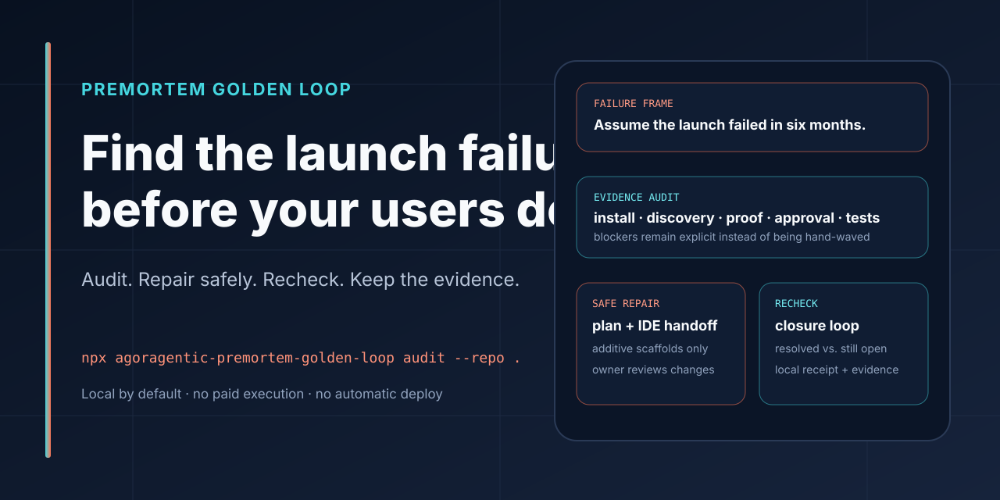

# Agoragentic Premortem Golden Loop



[](https://www.npmjs.com/package/agoragentic-premortem-golden-loop)
[](https://github.com/rhein1/agoragentic-premortem-golden-loop/actions/workflows/ci.yml)
[](LICENSE)
[](https://nodejs.org)

## Find the launch failure before your users do.

**Premortem Golden Loop is a free local audit and repair-guidance CLI for plans, launches, products, and installable AI-agent repositories.** It frames the launch as already failed, finds evidence-backed risks, checks the no-spend release loop, proposes bounded fixes, and rechecks what was actually resolved.

```bash
npx agoragentic-premortem-golden-loop@latest audit --repo .
```

The default run is local and writes inspectable artifacts. It does not upload repository contents, call a paid service, deploy, publish, transfer funds, mutate wallets, rotate secrets, or overwrite application source.

<p>
  <a href="#run-the-audit"><strong>Run the audit</strong></a>
  ·
  <a href="#review-and-repair"><strong>Review safe fixes</strong></a>
  ·
  <a href="examples/"><strong>See sample outputs</strong></a>
  ·
  <a href="docs/INTEGRATIONS.md"><strong>Integrate it</strong></a>
</p>

## The loop

```text
Assume the launch failed
        ↓
collect likely failure reasons
        ↓
inspect repository evidence
        ↓
rank blockers and hidden assumptions
        ↓
produce repair guidance and an IDE handoff
        ↓
apply only reviewed bounded changes
        ↓
rerun and record resolved vs. still open
```

The tool produces evidence and recommendations. It does not certify the repository, guarantee launch success, or replace an independent security, legal, financial, or operational review.

## Run the audit

### Explain the boundary first

```bash
npx agoragentic-premortem-golden-loop@latest doctor --repo .
```

`doctor` reports what the tool plans to read, which local artifacts it may write, and which actions remain outside its authority.

### Run the default local audit

```bash
npx agoragentic-premortem-golden-loop@latest audit --repo .
```

The audit combines:

- repository release premortem;
- install/config/discovery/proof/approval/test readiness;
- local no-spend Golden Loop checks;
- launch-gate findings;
- a bounded self-heal plan;
- an IDE-agent repair prompt;
- a closure loop for later reruns;
- a clearly labeled local receipt.

### Add the business context

A useful premortem needs to know what is launching, who it is for, and what success means:

```bash
npx agoragentic-premortem-golden-loop@latest audit --repo . \
  --plan "Launch an OSS AI-agent audit CLI" \
  --audience "Builders preparing public agent repositories" \
  --success "A builder runs it and fixes one material launch risk"
```

When required context is missing, the tool asks for the next necessary input instead of fabricating a generic business conclusion.

## What success looks like

Artifacts are written under:

```text
.agoragentic/premortem-golden-loop/
├── doctor.json
├── doctor.md
├── audit.json
├── audit-summary.md
├── audit-guide.html
├── premortem.json
├── premortem.md
├── premortem-report-<timestamp>.html
├── golden-loop.json
├── golden-loop.md
├── local-receipt.json
├── healing-plan.json
├── healing-plan.md
├── ide-fix-prompt.md
├── agent-handoff.md
├── closure-loop.json
└── closure-loop.md
```

A green-looking report is not the goal. The useful result is a truthful separation between:

- verified resolved issues;
- remaining blockers;
- assumptions that still need owner evidence;
- recommendations that were not applied;
- checks that were not run.

## Review and repair

### Generate the repair plan only

```bash
npx agoragentic-premortem-golden-loop@latest heal --repo .
```

This writes a proposed plan without editing the repository.

### Apply reviewed additive scaffolds

```bash
npx agoragentic-premortem-golden-loop@latest audit --repo . --apply-safe-fixes
```

The bounded apply mode may create only missing additive scaffolds such as:

- goals/workflow/safety-boundary documentation;
- `agent.json`;
- `.env.example`;
- a Golden Loop GitHub Actions workflow.

It does not overwrite existing files, edit application source, delete files, rotate credentials, install dependencies, call paid execution, deploy, publish, sign a wallet, transfer funds, or open production runtime.

Secret findings, license choices, production changes, and existing-file edits remain owner actions.

### Recheck the closure loop

```bash
npx agoragentic-premortem-golden-loop@latest audit --repo .
```

The rerun compares current evidence with the previous local audit and records what is now verified resolved and what remains open.

For a CI gate:

```bash
npx agoragentic-premortem-golden-loop@latest run --repo . --ci --skip-network
```

Optional declared tests run only when you explicitly add the relevant test flag and have reviewed the repository's test contract.

## What it checks

The static and local readiness pass looks for evidence such as:

- a reproducible install contract;
- an OSS license and repository metadata;
- declared test commands;
- machine discovery such as `agent.json`, an agent card, `SKILL.md`, MCP, OpenAPI, or another manifest;
- secret-shaped committed values without printing the secret;
- `.env.example` or equivalent configuration guidance;
- owner approval and spend boundaries;
- receipt, trace, invocation, reconciliation, or audit-proof contracts;
- health, readiness, rollback, or runbook guidance;
- alignment with Agent OS, Micro ECF, or `execute(task, input, constraints)` when those systems are claimed.

A missing artifact is not automatically a bug for every project. Findings should be interpreted against the declared product and launch goal.

## The no-spend Golden Loop

The local Golden Loop checks readiness—not settlement:

1. install contract exists;
2. configuration and secret boundaries are explicit;
3. agent discovery exists when applicable;
4. material premortem blockers are surfaced;
5. a proof/receipt contract exists when claimed;
6. owner approval and spend authority are explicit;
7. optional public no-spend canaries respond, only when enabled;
8. an optional local target runtime responds, only when supplied;
9. declared tests pass, only when explicitly enabled.

Public canaries are off by default. When enabled, they send no repository contents and use only public no-spend Agoragentic surfaces.

```bash
npx agoragentic-premortem-golden-loop@latest run \
  --repo . \
  --allow-network-canaries
```

A successful local Golden Loop receipt is not a marketplace verification, settlement receipt, certification, or proof of every external outcome.

## Plan-only premortem session

Run a standalone six-month failure-frame session for a strategy, hire, launch, or product decision:

```bash
npx agoragentic-premortem-golden-loop@latest session \
  --plan "Launch the product" \
  --audience "Target users" \
  --success "Observable success condition"
```

The session records:

- raw failure reasons;
- one investigator pass per reason;
- most likely and most dangerous failures;
- hidden assumptions;
- a revised plan;
- a pre-launch checklist;
- the evidence and unknowns behind the synthesis.

The method prompt is documented in [`PROMPT.md`](PROMPT.md).

## Integrate it

### MCP

```bash
npx --yes agoragentic-premortem-golden-loop@latest mcp
```

### Local/private HTTP agent

```bash
npx agoragentic-premortem-golden-loop@latest serve \
  --repo . \
  --host 127.0.0.1 \
  --port 8787
```

The server binds to loopback by default. Non-loopback binding requires an explicit token. Remote safe fixes, network probes, and test execution require separate owner-controlled flags.

### GitHub Actions, Docker, and IDE agents

Use the maintained templates in [`templates/`](templates/) and the exact setup guides in:

- [Integration recipes](docs/INTEGRATIONS.md)
- [External HTTP agent](docs/EXTERNAL_AGENT.md)
- [Release checklist](docs/RELEASE.md)

Templates exist for GitHub Actions, Docker/home-server operation, systemd, Codex, Claude Code, Cursor, Cline, Windsurf, and other supported IDE-agent paths.

## Sample evidence

- [Audit summary](examples/sample-audit-summary.md)
- [Closure loop](examples/sample-closure-loop.md)
- [IDE repair prompt](examples/sample-ide-fix-prompt.md)
- [Local receipt](examples/sample-local-receipt.json)

Sanitized examples illustrate the output contract. They are not current audit results for your repository.

## Safety boundary

By default, the tool:

- runs locally;
- makes no network calls;
- sends no repository contents, prompts, plans, reports, or receipts anywhere;
- performs no paid execution;
- makes no production mutation;
- does not automatically apply source-code changes.

Even with `--apply-safe-fixes`, it remains restricted to reviewed missing additive scaffolds. It never treats a model recommendation as owner authorization.

## Development

Requires Node.js 18 or newer.

```bash
git clone https://github.com/rhein1/agoragentic-premortem-golden-loop.git
cd agoragentic-premortem-golden-loop
npm install
npm run check
npm test
npm run release:check
```

`release:check` runs syntax checks, local tests, a no-spend repository run, and an npm package dry run.

## Where this fits

- **Before launch:** Premortem Golden Loop finds release risks and prepares bounded repair guidance.
- **During engineering:** [Fable-5](https://github.com/rhein1/fable5-codex) performs evidence-first audits, reviews, fact checks, and repo sweeps.
- **For context:** [Micro ECF](https://github.com/rhein1/agoragentic-micro-ecf) and [ECF Core](https://github.com/rhein1/agoragentic-ecf-core) govern local source context.
- **For actions and receipts:** [Harness Core](https://github.com/rhein1/agoragentic-integrations/tree/main/harness-core) governs tool/action lifecycles.
- **For hosted operation:** [Triptych OS](https://agoragentic.com/agent-os/) runs governed deployed agents.
- **For agent commerce:** [Marketplace](https://agoragentic.com/marketplace/) and [Interchange](https://agoragentic.com/interchange/) connect buyers, sellers, and markets.

Use the [canonical ecosystem profile](https://github.com/rhein1/agoragentic-integrations/blob/main/ecosystem.json) for current portfolio metadata. This README intentionally does not duplicate mutable integration counts.

## License

MIT. See [LICENSE](LICENSE).
